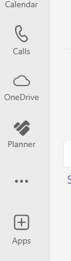

## Goals

- [x] **Solve Bug** ️🎉
  {: width="20%"}
  - [x] Analyze
  - [x] Implement Backend
  - [ ] Implement Frontend
  - [ ] Testen

---

## Tasks

️
---

## Notes
- ️🐞 New bug found: ️️
{ : width=10%}

---

## Time table

<table>
  <tr> <td>5</td> 
  <tr> <td>6</td>
  <tr> <td>7</td> 
  <tr> <td>8</td> 
    <td rowspan=3><input type="checkbox" unchecked>something important</td>
  <tr> <td>9</td> 
    <td rowspan=1><input type="checkbox" unchecked>Daily</td>
  <tr> <td>10</td> 
  <tr> <td>11</td>
  <tr> <td>12</td>
  <tr> <td>13</td>
    <td rowspan=1><input type="checkbox" unchecked>Meeting</td>
  <tr> <td>14</td>
  <tr> <td>15</td>
  <tr> <td>16</td>
  <tr> <td>17</td>
  <tr> <td>18</td>
  <tr> <td>19</td>
  <tr> <td>20</td>
  <tr> <td>21</td>
  </tr>
</table>
