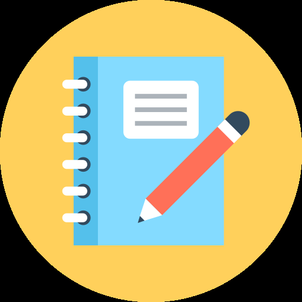
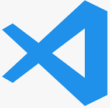
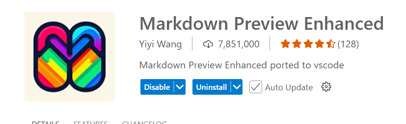

<!-- slide -->

# Motivation:

- Take notes quickly
- Code examples, editable (C#, typescript)
- Pictures
- Version control, Git, Diff

<!-- slide -->

# Vs as Notebook

<!-- slide -->

## Tools:

{ : width=20%}
{ : width=60%}

<!-- slide -->

# Demo
